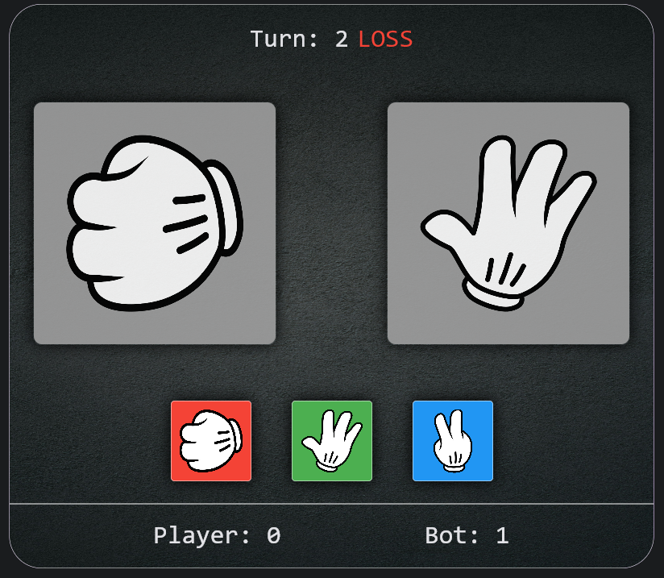

# Rock Paper Scissors Game

Welcome to the Rock Paper Scissors game implemented in Python! 
The computer logic is based on Markov chains, hence it tries to predict your next move.



## Installation

1. Clone this repository to your local machine using Git:
   ```
   git clone https://github.com/HiKami172/rps-game.git
   ```
   
2. Navigate to the directory containing the game files:
   ```
   cd rps-game
   ```

3. Install the required dependencies using pip:
   ```
   pip install -r requirements.txt
   ```
